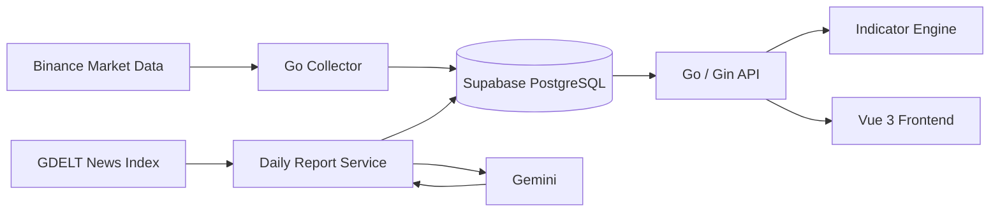

# GoFin-Tracker 📈

以 **Go + Vue 3** 打造的金融市場資訊整合與 AI 分析平台，將市場價格、技術指標、新聞來源與每日分析報告整理在同一個介面中。

[線上展示](https://gofin-tracker-flame.vercel.app/) · [AI 日報 API 文件](docs/daily-report-api.md)

> 後端目前部署於 Render 免費方案。服務閒置後首次開啟，可能因 Cold Start 等待約 30～50 秒。

## 核心功能

- **市場資料收集**：Collector 從 Binance 取得 BTCUSDT 日線資料，並以 UPSERT 避免重複紀錄。
- **技術指標分析**：Go API 在記憶體中計算 MACD、MA7、MA25、Bollinger Bands 與 RSI。
- **互動式圖表**：Vue 3 前端使用 TradingView Lightweight Charts 呈現 K 線與指標。
- **商品搜尋**：透過公開 API 查詢商品、交易所與市場類型。
- **AI 每日報告**：整合 GDELT 新聞索引與 Gemini，產生帶有來源資訊的結構化草稿。
- **審核後發布**：日報先以草稿保存，通過資料庫完整性驗證後才會公開於列表與閱讀頁。

AI 內容僅用於資訊整理與研究輔助，不會自動執行交易，也不構成投資建議。

## 系統架構



設計重點：

- API Server 與 Collector 使用獨立進入點，避免資料收集工作阻塞 Web API。
- K 線以 `(time, exchange_symbol_id, interval)` 識別，重複收集時安全更新既有資料。
- 技術指標由後端即時計算，不另外儲存衍生資料。
- AI 只處理後端整理過的市場與新聞內容；草稿不會自動公開。

## 技術棧

| Layer | Technology |
| --- | --- |
| Backend | Go、Gin、PostgreSQL driver |
| Frontend | Vue 3、TypeScript、Vite、Vue Router |
| Charting | TradingView Lightweight Charts |
| Database | Supabase PostgreSQL、SQL Migrations |
| AI & News | Gemini API、GDELT DOC API |
| Deployment | Render、Vercel、GitHub Actions |

## 快速開始

### 1. 前置需求

- Go 1.26+
- Node.js
- Docker Desktop
- Supabase CLI

### 2. 取得專案

```bash
git clone https://github.com/yoo4436/gofin-tracker.git
cd gofin-tracker
```

### 3. 啟動本機資料庫

```bash
supabase start
supabase db reset --local
```

`db reset --local` 只會重建本機 Supabase；不會更新遠端資料庫。將 `supabase status` 顯示的本機 PostgreSQL 連線字串填入根目錄 `.env`：

```bash
cp .env.example .env
```

```env
DATABASE_URL="your_local_postgresql_connection_string"
```

如需產生 AI 日報，再設定 `GEMINI_API_KEY`、`GEMINI_MODEL` 與 `DAILY_REPORT_API_TOKEN`。請勿提交 `.env` 或任何真實金鑰。

### 4. 啟動後端

```bash
go mod download
go run backend/cmd/api/main.go
```

API 預設位於 `http://localhost:8080`。如需抓取最新市場資料，可在另一個終端機執行：

```bash
go run backend/cmd/collector/main.go
```

### 5. 啟動前端

```bash
cp frontend/.env.example frontend/.env.local
cd frontend
npm install
npm run dev
```

前端只需要公開 API 位址：

```env
VITE_API_BASE_URL="http://localhost:8080"
```

管理端 Token 與 Gemini API Key 僅能放在後端環境，不可加入前端設定。

## 主要 API

| Method | Endpoint | Description |
| --- | --- | --- |
| `GET` | `/api/v1/symbols` | 搜尋商品與市場資訊 |
| `GET` | `/api/v1/klines` | 取得 K 線與技術指標 |
| `GET` | `/api/v1/reports` | 取得已發布的日報列表 |
| `GET` | `/api/v1/reports/:id` | 取得單篇已發布日報 |

日報產生與發布屬於受保護的管理流程，使用方式請參考 [AI 日報 API 文件](docs/daily-report-api.md)。

## 專案結構

```text
gofin-tracker/
├── backend/
│   ├── cmd/api/           # REST API
│   ├── cmd/collector/     # 市場資料收集
│   └── internal/          # AI 日報、Gemini、GDELT
├── frontend/              # Vue 3 使用者介面
├── supabase/migrations/   # 資料庫結構與發布流程
└── docs/                  # 進階開發文件
```

## Roadmap

- [x] 加密貨幣 K 線與技術指標
- [x] 商品搜尋與互動式圖表
- [x] GDELT 新聞整合與 AI 日報草稿
- [x] 日報審核、發布與公開閱讀頁
- [ ] 更多市場與時間週期
- [ ] 多來源新聞交叉驗證
- [ ] 個人化 Watchlist 與通知
- [ ] Portfolio Tracking 與 Backtesting

## 免責聲明

本專案提供的市場資料、技術指標、新聞內容與 AI 產生內容，僅供資訊整理、技術研究與學習用途，**不構成任何形式的投資建議、買賣建議或報酬保證**。任何投資決策與風險均由使用者自行承擔。

## Author

**Denny Ye（葉星佑）** · [GitHub](https://github.com/yoo4436)
