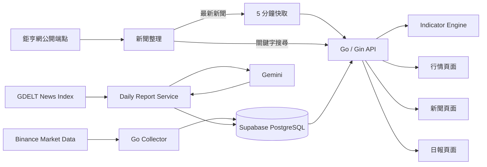

# GoFin-Tracker 📈

GoFin-Tracker 把市場行情、技術指標、即時新聞和 AI 日報放在同一個網站。前端使用 Vue 3，行情計算、新聞整理和日報流程交給 Go 後端處理。

[線上展示](https://gofin-tracker-flame.vercel.app/) · [AI 日報 API 文件](docs/daily-report-api.md)

> 後端目前放在 Render 免費方案。如果服務閒置了一段時間，第一次開啟可能會遇到 Cold Start，約需等待 30～50 秒。

## 核心功能

- Collector 會讀取資料庫中啟用的 Binance 交易對，抓取日線資料並用 UPSERT 更新既有紀錄。
- 查詢行情時，Go API 會直接計算 MACD、MA7、MA25、Bollinger Bands 和 RSI，不另外儲存這些衍生資料。
- 前端用 TradingView Lightweight Charts 顯示 K 線與指標，也能搜尋商品並切換不同交易對。
- 新聞頁面把鉅亨網公開資料分成台股、國際情勢與美股三類。可以用公司、產業或事件名稱搜尋，每則新聞都保留來源、發布時間與原文連結。
- AI 日報是另一套流程：後端從 GDELT 取得新聞索引，再交給 Gemini 整理成附有來源的日報草稿。
- 日報產生後會先存成草稿，不會直接上線。管理端送出發布要求後，資料庫會先檢查內容、新聞項目和來源，通過才會出現在公開頁面。

AI 內容只用來整理資訊和輔助研究，不會自動執行交易，也不構成投資建議。

## 系統架構



市場資料收集和查詢 API 是兩支獨立程式，Collector 的工作不會卡住網頁請求。K 線重複抓取時會更新原紀錄，技術指標則在查詢時才計算。

首頁新聞會快取 5 分鐘。輸入關鍵字搜尋時，後端會直接向來源查詢。AI 日報仍維持草稿與發布分離。

## 技術組成

| 類別 | 使用技術 |
| --- | --- |
| 後端 | Go、Gin、lib/pq |
| 前端 | Vue 3、TypeScript、Vite、Vue Router |
| 圖表 | TradingView Lightweight Charts |
| 資料庫 | Supabase PostgreSQL、SQL Migrations |
| 新聞與 AI | 鉅亨網公開端點、GDELT DOC API、Gemini API |
| 部署 | Render、Vercel、GitHub Actions |

## 快速開始

### 1. 前置需求

- Go 1.26+
- Node.js
- Docker Desktop
- Supabase CLI

### 2. 取得專案

```bash
git clone https://github.com/yoo4436/gofin-tracker.git
cd gofin-tracker
```

### 3. 啟動本機資料庫

```bash
supabase start
supabase db reset --local
```

`db reset --local` 只會重建本機 Supabase，不會動到遠端資料庫。接著執行 `supabase status`，把顯示的 PostgreSQL 連線字串填入根目錄的 `.env`。

```bash
cp .env.example .env
```

```env
DATABASE_URL="your_local_postgresql_connection_string"
```

`.env.example` 已附上本機 CORS 與鉅亨網端點設定，通常不用修改。只有產生 AI 日報時，才需要另外填入 `GEMINI_API_KEY`、`GEMINI_MODEL` 和 `DAILY_REPORT_API_TOKEN`。不要提交 `.env` 或真實金鑰。

### 4. 啟動後端

```bash
go mod download
go run backend/cmd/api/main.go
```

API 預設位於 `http://localhost:8080`。要更新資料庫中已啟用的 Binance 交易對，可以另開一個終端機執行 Collector：

```bash
go run backend/cmd/collector/main.go
```

### 5. 啟動前端

```bash
cp frontend/.env.example frontend/.env.local
cd frontend
npm install
npm run dev
```

前端只需要設定公開 API 位址：

```env
VITE_API_BASE_URL="http://localhost:8080"
```

管理端 Token 和 Gemini API Key 都留在後端，不要放進 `frontend/` 或 Vercel 的前端環境變數。

## 主要 API

| 方法 | 端點 | 用途 |
| --- | --- | --- |
| `GET` | `/api/v1/symbols` | 搜尋商品與市場資訊 |
| `GET` | `/api/v1/klines` | 取得 K 線與技術指標 |
| `GET` | `/api/v1/news` | 取得台股、國際情勢與美股新聞 |
| `GET` | `/api/v1/reports` | 取得已發布的日報列表 |
| `GET` | `/api/v1/reports/:id` | 取得單篇已發布日報 |

產生日報與發布草稿都需要管理端 Token，完整呼叫方式請參考 [AI 日報 API 文件](docs/daily-report-api.md)。

## 專案結構

```text
gofin-tracker/
├── backend/
│   ├── cmd/api/           # REST API
│   ├── cmd/collector/     # 市場資料收集
│   └── internal/          # 新聞來源與 AI 日報
├── frontend/              # Vue 3 使用者介面
├── supabase/migrations/   # 資料庫結構與發布流程
└── docs/                  # 開發與 API 文件
```

## 開發進度

- [x] 加密貨幣 K 線與技術指標
- [x] 商品搜尋與互動式圖表
- [x] 鉅亨網新聞分類、搜尋與原文連結
- [x] GDELT 新聞整合與 AI 日報草稿
- [x] 日報檢查、發布與公開閱讀頁
- [ ] 更多市場與時間週期
- [ ] 多來源新聞交叉驗證
- [ ] 個人化 Watchlist 與通知
- [ ] Portfolio Tracking 與 Backtesting

## 免責聲明

本專案提供的市場資料、技術指標、新聞與 AI 內容，只供資訊整理、技術研究和學習使用，**不構成任何形式的投資建議、買賣建議或報酬保證**。投資決策與風險仍由使用者自行承擔。

## 作者

**Denny Ye（葉星佑）** · [GitHub](https://github.com/yoo4436)
